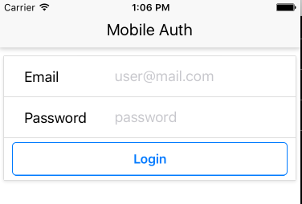
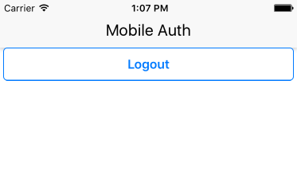

# Mobile Auth




## Installation

Install all package dependencies:

```
npm install
```

Make a terminal window for the packager:

```
npm start
```

Then, on a different window, after starting the packager, run the Xcode simulator (for iOS development) using:

```
react-native run-ios
```

If you are doing Android development, use:

```
react-native run-android
```
